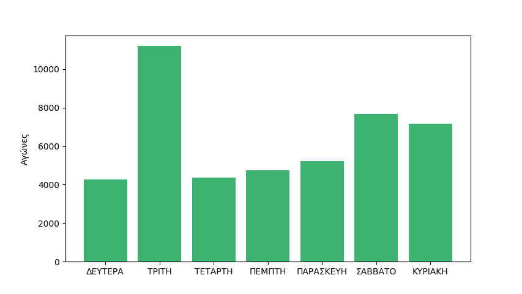

# Ενδεικτική λύση εργαστηριακής άσκησης 2 2023-2024 

**Εκφώνηση**

* [2η εργαστηριακή άσκηση](./projects/2024_agp_assignment2.pdf)

**Λύση**


```{.py title="my_re_functions.py" linenums="1"}
--8<-- "assignments/2024_2/my_re_functions.py"
```


```{.py title="test_my_re_functions.py" linenums="1"}
--8<-- "assignments/2024_2/test_my_re_functions.py"
```


```cmd
$ python test_my_re_functions.py
....
----------------------------------------------------------------------
Ran 4 tests in 0.002s

OK
```


```{.py title="erotima1.py" linenums="1"}
--8<-- "assignments/2024_2/erotima1.py"
```

```cmd
$ python erotima1.py WorldChamp2023.pgn
Ημερομηνία: 2023-04-09
Νικητής: ΙΣΟΠΑΛΙΑ
Διαφορά δυναμικότητας: 7
Πλήθος κινήσεων: 49
Θέλεις να συνεχίσεις; (ε για επόμενο, ο για όλα, δ για διακοπή)ε
Ημερομηνία: 2023-04-10
Νικητής: ΜΑΥΡΑ
Διαφορά δυναμικότητας: 7
Πλήθος κινήσεων: 29
Θέλεις να συνεχίσεις; (ε για επόμενο, ο για όλα, δ για διακοπή)ο
Ημερομηνία: 2023-04-12
Νικητής: ΙΣΟΠΑΛΙΑ
Διαφορά δυναμικότητας: 7
Πλήθος κινήσεων: 30
Ημερομηνία: 2023-04-13
Νικητής: ΛΕΥΚΑ
Διαφορά δυναμικότητας: 7
Πλήθος κινήσεων: 47
Ημερομηνία: 2023-04-15
Νικητής: ΛΕΥΚΑ
Διαφορά δυναμικότητας: 7
Πλήθος κινήσεων: 48
Ημερομηνία: 2023-04-16
Νικητής: ΛΕΥΚΑ
Διαφορά δυναμικότητας: 7
Πλήθος κινήσεων: 44
Ημερομηνία: 2023-04-18
Νικητής: ΛΕΥΚΑ
Διαφορά δυναμικότητας: 7
Πλήθος κινήσεων: 37
Ημερομηνία: 2023-04-20
Νικητής: ΙΣΟΠΑΛΙΑ
Διαφορά δυναμικότητας: 7
Πλήθος κινήσεων: 45
Ημερομηνία: 2023-04-21
Νικητής: ΙΣΟΠΑΛΙΑ
Διαφορά δυναμικότητας: 7
Πλήθος κινήσεων: 82
Ημερομηνία: 2023-04-23
Νικητής: ΙΣΟΠΑΛΙΑ
Διαφορά δυναμικότητας: 7
Πλήθος κινήσεων: 45
Ημερομηνία: 2023-04-24
Νικητής: ΙΣΟΠΑΛΙΑ
Διαφορά δυναμικότητας: 7
Πλήθος κινήσεων: 39
Ημερομηνία: 2023-04-26
Νικητής: ΛΕΥΚΑ
Διαφορά δυναμικότητας: 7
Πλήθος κινήσεων: 38
Ημερομηνία: 2023-04-27
Νικητής: ΙΣΟΠΑΛΙΑ
Διαφορά δυναμικότητας: 7
Πλήθος κινήσεων: 40
Ημερομηνία: 2023-04-29
Νικητής: ΙΣΟΠΑΛΙΑ
Διαφορά δυναμικότητας: 7
Πλήθος κινήσεων: 90
```


```{.py title="erotima2.py" linenums="1"}
--8<-- "assignments/2024_2/erotima2.py"
```

```cmd
$ python erotima2.py
[('ΔΕΥΤΕΡΑ', 4284), ('ΤΡΙΤΗ', 11196), ('ΤΕΤΑΡΤΗ', 4361), ('ΠΕΜΠΤΗ', 4743), ('ΠΑΡΑΣΚΕΥΗ', 5220), ('ΣΑΒΒΑΤΟ', 7669), ('ΚΥΡΙΑΚΗ', 7153)]
total_games=44626
```


