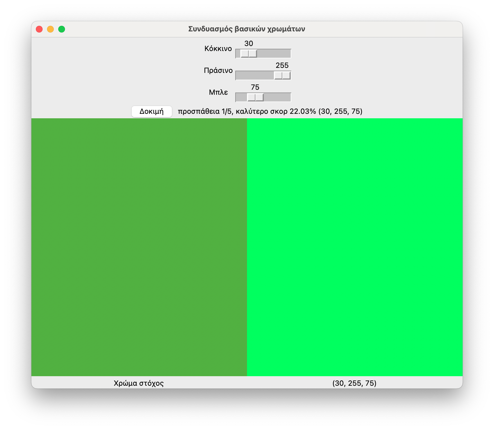

# Ενδεικτική λύση εργαστηριακής άσκησης 2 2023-2024 

**Εκφώνηση**

* [3η εργαστηριακή άσκηση](./projects/2024_agp_assignment3.pdf)

**Λύση**


```{.py title="utils.py" linenums="1"}
--8<-- "assignments/2024_3/utils.py"
```


```{.py title="rgb_game.py" linenums="1"}
--8<-- "assignments/2024_3/rgb_game.py"
```


```cmd
$ python rgb_game.py
```




