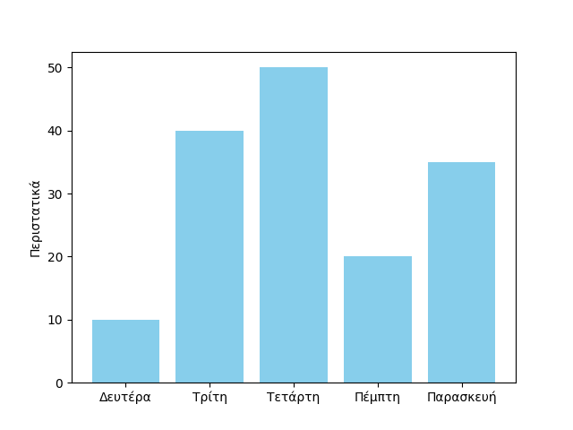

## Διαφάνειες από τον [Marko Knöbl](https://marko-knoebl.github.io/slides/index-en.html)
* [Python basics](https://marko-knoebl.github.io/slides/python-beginner-collection-en.html)
* [Python intermediate](https://marko-knoebl.github.io/slides/python-intermediate-collection-en.html)
* [Python advanced](https://marko-knoebl.github.io/slides/python-advanced-collection-en.html)
* [Python in practice](https://marko-knoebl.github.io/slides/python-in-practice-collection-en.html)
* [Python and data science](https://marko-knoebl.github.io/slides/python-data-science-0-overview-collection-en.html)

## Notebooks εισαγωγής στην Python

1. [Εισαγωγή](https://github.com/chgogos/dituoi_agp/blob/main/pl/python/notebooks/01-intro.ipynb)
2. [Λεκτικά](https://github.com/chgogos/dituoi_agp/blob/main/pl/python/notebooks/02-strings.ipynb)
3. [Λίστες, πλειάδες, λεξικά και σύνολα](https://github.com/chgogos/dituoi_agp/blob/main/pl/python/notebooks/03-lists-tuples-dictionaries-sets.ipynb)
4. [Η εντολή if](https://github.com/chgogos/dituoi_agp/blob/main/pl/python/notebooks/04-conditionals.ipynb)
5. [Επαναλήψεις](https://github.com/chgogos/dituoi_agp/blob/main/pl/python/notebooks/05-loops.ipynb)
6. [Comprehensions](https://github.com/chgogos/dituoi_agp/blob/main/pl/python/notebooks/06-comprehensions.ipynb)
7. [Εξαιρέσεις](https://github.com/chgogos/dituoi_agp/blob/main/pl/python/notebooks/07-exceptions.ipynb)
8. [Αρχεία](https://github.com/chgogos/dituoi_agp/blob/main/pl/python/notebooks/08-files.ipynb)
9. [Συναρτήσεις](https://github.com/chgogos/dituoi_agp/blob/main/pl/python/notebooks/09-functions.ipynb)
10. [Συναρτήσεις λάμδα](https://github.com/chgogos/dituoi_agp/blob/main/pl/python/notebooks/10-lambdas.ipynb)
11. [Κλάσεις](https://github.com/chgogos/dituoi_agp/blob/main/pl/python/notebooks/11-classes.ipynb)
12. [Logging](https://github.com/chgogos/dituoi_agp/blob/main/pl/python/notebooks/12-logging.ipynb)
13. [Testing](https://github.com/chgogos/dituoi_agp/blob/main/pl/python/notebooks/13-testing.ipynb)
14. [CSV](https://github.com/chgogos/dituoi_agp/blob/main/pl/python/notebooks/14-csv.ipynb)
15. [Excel](https://github.com/chgogos/dituoi_agp/blob/main/pl/python/notebooks/15-excel.ipynb)
16. [XML](https://github.com/chgogos/dituoi_agp/blob/main/pl/python/notebooks/16-xml.ipynb)
17. [JSON](https://github.com/chgogos/dituoi_agp/blob/main/pl/python/notebooks/17-json.ipynb)
18. [YAML](https://github.com/chgogos/dituoi_agp/blob/main/pl/python/notebooks/18-yaml.ipynb)
19. [Αποθήκευση (serialize) αντικειμένων με το pickle](https://github.com/chgogos/dituoi_agp/blob/main/pl/python/notebooks/19-pickle.ipynb)
20. [Ημερομηνίες και ώρες](https://github.com/chgogos/dituoi_agp/blob/main/pl/python/notebooks/20-datetime.ipynb)
21. [Τυχαίες τιμές](https://github.com/chgogos/dituoi_agp/blob/main/pl/python/notebooks/21-random.ipynb)
22. [Κανονικές εκφράσεις](https://github.com/chgogos/dituoi_agp/blob/main/pl/python/notebooks/22-regular_expressions.ipynb)
23. [Generators](https://github.com/chgogos/dituoi_agp/blob/main/pl/python/notebooks/23-generators.ipynb)
24. [Iterators](https://github.com/chgogos/dituoi_agp/blob/main/pl/python/notebooks/24-iterators.ipynb)
25. [Το module itertools](https://github.com/chgogos/dituoi_agp/blob/main/pl/python/notebooks/25-itertools.ipynb)
26. [enums](https://github.com/chgogos/dituoi_agp/blob/main/pl/python/notebooks/26-enums.ipynb)
27. [Το module urllib](https://github.com/chgogos/dituoi_agp/blob/main/pl/python/notebooks/27-urllib.ipynb)
28. [Το module requests](https://github.com/chgogos/dituoi_agp/blob/main/pl/python/notebooks/28-requests.ipynb)
29. [bs4](https://github.com/chgogos/dituoi_agp/blob/main/pl/python/notebooks/29-bs4.ipynb)
30. [Το module collections](https://github.com/chgogos/dituoi_agp/blob/main/pl/python/notebooks/30-collections.ipynb)
31. [PLY - Python Lex Yacc](https://github.com/chgogos/dituoi_agp/blob/main/pl/python/notebooks/31-PLY.ipynb)
32. [Aliasing](https://github.com/chgogos/dituoi_agp/blob/main/pl/python/notebooks/32-alias.ipynb)
33. [AST](https://github.com/chgogos/dituoi_agp/blob/main/pl/python/notebooks/33-abstract_syntax_trees.ipynb)
34. [Υπερφόρτωση τελεστών](https://github.com/chgogos/dituoi_agp/blob/main/pl/python/notebooks/34-operator_overloading.ipynb)
35. [Τροποποιήσιμα και μη τροποποιήσιμα αντικείμενα](https://github.com/chgogos/dituoi_agp/blob/main/pl/python/notebooks/35-mutable_vs_immutable.ipynb)
36. [numpy](https://github.com/chgogos/dituoi_agp/blob/main/pl/python/notebooks/36-numpy.ipynb)
37. [pandas](https://github.com/chgogos/dituoi_agp/blob/main/pl/python/notebooks/37-pandas.ipynb)
38. [matplotlib](https://github.com/chgogos/dituoi_agp/blob/main/pl/python/notebooks/38-matplotlib.ipynb)
39. [dataclasses](https://github.com/chgogos/dituoi_agp/blob/main/pl/python/notebooks/39-dataclasses.ipynb)
40. [Το module functools](https://github.com/chgogos/dituoi_agp/blob/main/pl/python/notebooks/40-functools.ipynb)
41. [LEGB](https://github.com/chgogos/dituoi_agp/blob/main/pl/python/notebooks/41-LEGB.ipynb)
42. [Το module os](https://github.com/chgogos/dituoi_agp/blob/main/pl/python/notebooks/42-os.ipynb)
43. [Easter eggs](https://github.com/chgogos/dituoi_agp/blob/main/pl/python/notebooks/43-easter_eggs.ipynb)
44. [seaborn](https://github.com/chgogos/dituoi_agp/blob/main/pl/python/notebooks/44-seaborn.ipynb)
45. [datasets](https://github.com/chgogos/dituoi_agp/blob/main/pl/python/notebooks/45-datasets.ipynb)

## Βιβλία για Python
* [Programming Foundations - Διαδραστικό βιβλίο για εκμάθηση της Python από το TU Delft](https://interactivetextbooks.tudelft.nl/programming-foundations/intro.html)
* [Automate the Boring Stuff with Python by Al Sweigart](https://automatetheboringstuff.com/)
* [Think Python by Allen B. Downey](https://greenteapress.com/wp/think-python-2e/)
* [The Python Coding Book](https://thepythoncodingbook.com/)
* [A byte of Python by Swaroop](https://python.swaroopch.com/)
    * [Μετάφραση στα Ελληνικά]( http://dide.flo.sch.gr/Plinet/Meetings/Meeting23/A_Byte_of_Python-el.pdf)
* [Μανής, Γ. (2015). Εισαγωγή στον Προγραμματισμό με αρωγό τη γλώσσα Python [Προπτυχιακό εγχειρίδιο]. Κάλλιπος, Ανοικτές Ακαδημαϊκές Εκδόσεις. https://hdl.handle.net/11419/2745](https://repository.kallipos.gr/handle/11419/2745)
* [Μαγκούτης, Κ., & Νικολάου, Χ. (2015). Εισαγωγή στον αντικειμενοστραφή προγραμματισμό με Python [Προπτυχιακό εγχειρίδιο]. Κάλλιπος, Ανοικτές Ακαδημαϊκές Εκδόσεις. https://hdl.handle.net/11419/1708](https://repository.kallipos.gr/handle/11419/1708)
* [Παναγιώτου, Γ. (2022). Μια εισαγωγή στην Python για Μεταλλειολόγους & άλλους Μηχανικούς [Προπτυχιακό εγχειρίδιο]. Κάλλιπος, Ανοικτές Ακαδημαϊκές Εκδόσεις. https://dx.doi.org/10.57713/kallipos-99](https://repository.kallipos.gr/handle/11419/8587)
* [Github repository με ελεύθερα διαθέσιμα βιβλία για Python](https://github.com/pamoroso/free-python-books)

## Online μαθήματα
* [Python Programming MOOC 2024 by University of Helsinki](https://programming-24.mooc.fi/)
* [CS50’s Introduction to Programming with Python by Harvard](https://cs50.harvard.edu/python/2022/)
* [PY4E: Python for everybody](https://www.py4e.com/)
* [python-course.eu](https://python-course.eu/)
* [MITx: Introduction to Computer Science and Programming Using Python](https://www.edx.org/learn/computer-science/massachusetts-institute-of-technology-introduction-to-computer-science-and-programming-using-python)

## Tutorials
* [futurecoder.io](https://futurecoder.io/)
* [PyFlo](https://pyflo.net/)
* [Practical Python Programming by David Beazley](https://dabeaz-course.github.io/practical-python/)
* [Learn X in Y minutes Where X=Python](https://learnxinyminutes.com/python/)
* [PyQuest](https://github.com/ivnvxd/pyquest)
* [Python Koans](https://github.com/gregmalcolm/python_koans)

## Videos
* [Corey Schafer -  Python tutorials](https://www.youtube.com/watch?v=YYXdXT2l-Gg&list=PL-osiE80TeTt2d9bfVyTiXJA-UTHn6WwU)
* [Tech with Tim - Python Programming Tutorials](https://www.youtube.com/watch?v=OFrLs22MDAw&list=PLzMcBGfZo4-mFu00qxl0a67RhjjZj3jXm)
* [Socratica - Python learning tutorials](https://www.youtube.com/playlist?list=PLi01XoE8jYohWFPpC17Z-wWhPOSuh8Er-)
<!-- * [CS50x -  Python](https://cs50.harvard.edu/x/2021/shorts/python/) -->

## Cheat sheets
* [Python 3 Cheat Sheet (v2.0.6) by Laurent Pointal](./resources/mementopython3-english.pdf)
* [The *Best Python Cheat Sheet](https://kieranholland.com/best-python-cheat-sheet/)
* [Python Crash Course cheat sheets](https://ehmatthes.github.io/pcc/cheatsheets/README.html)
* [Python Cheat Sheet for coding intreviews (Neetcode)](https://neetcode.io/courses/lessons/python-for-coding-interviews)

## Python roadmap
[](https://roadmap.sh/python)

## Αποσπάσματα κώδικα

??? note "ανάγνωση και εκτύπωση ημερομηνιών"
    ```{.py title="datetime_example.py" linenums="1"}
    --8<-- "projects/datetime_example.py"
    ```
    Ένα παράδειγμα εκτέλεσης
    ```
    $ python datetime_example.py
    10/04/2024
    10|4|24
    10-April-24
    Wed 10 Apr 2024
    ```


??? note "ορίσματα γραμμής εντολών με το sys.argv"
    ```{.py title="command_line_arg_example1.py" linenums="1"}
    --8<-- "projects/command_line_arg_example1.py"
    ```
    Ένα παράδειγμα εκτέλεσης
    ```
    $ python command_line_arg_example1.py 1 a bcde
    ΠΛΗΘΟΣ ΟΡΙΣΜΑΤΩΝ: 4
    όρισμα 0 με τιμή /Users/.../command_line_arg_example1.py
    όρισμα 1 με τιμή 1
    όρισμα 2 με τιμή a
    όρισμα 3 με τιμή bcde
    ```

??? note "ορίσματα γραμμής εντολών με το argparse"
    ```{.py title="argparse_example.py" linenums="1"}
    --8<-- "projects/argparse_example.py"
    ```
    Ένα παράδειγμα εκτέλεσης
    ```
    $ python argparse_example.py -i a.txt -o b.txt
    Αρχείο εισόδου: a.txt
    Αρχείο εξόδου: b.txt
    ```

??? note "απλό γράφημα με το matplotlib"
    ```{.py title="matplotlib_example1.py" linenums="1"}
    --8<-- "projects/matplotlib_example1.py"
    ```
    Ένα παράδειγμα εκτέλεσης (θα πρέπει να έχει προηγηθεί η εγκατάσταση με το pip της βιβλιοθήκης matplotlib)
    ```
    $ python matplotlib_example1.py
    ```
    


??? note "χρονομέτρηση κώδικα στην Python με το time.time()"
    ```{.py title="time_execution1.py" linenums="1"}
    --8<-- "projects/time_execution1.py"
    ```
    Ένα παράδειγμα εκτέλεσης
    ```
    $ python time_execution1.py
    Execution time: 2.0694435829936992 seconds
    ```

??? note "χρονομέτρηση κώδικα στην Python με το timeit.default_timer()"
    ```{.py title="time_execution2.py" linenums="1"}
    --8<-- "projects/time_execution2.py"
    ```
    Ένα παράδειγμα εκτέλεσης
    ```
    $ python time_execution2.py
    Execution time: 1.9552855410147458 seconds
    ```

??? note "χρήση assert στην Python"
    ```{.py title="assert_example.py" linenums="1"}
    --8<-- "src/python/assert_example.py"
    ```
    Παραδείγμα εκτέλεσης 1
    ```
    $ python assert_example.py
    5.0
    Traceback (most recent call last):
    File "assert_example.py", line 6, in <module>
        print(divide(10, 0))  # AssertionError: Denominator cannot be zero!
    File "assert_example.py", line 2, in divide
        assert b != 0, "Denominator cannot be zero!"
    AssertionError: Denominator cannot be zero!
    ```
    Παραδείγμα εκτέλεσης 2
    ```
    $ python assert_example.py
    5.0
    Traceback (most recent call last):
    File "assert_example.py", line 6, in <module>
        print(divide(10, 0))  # AssertionError: Denominator cannot be zero!
    File "assert_example.py", line 3, in divide
        return a / b
    ZeroDivisionError: division by zero
    ```
