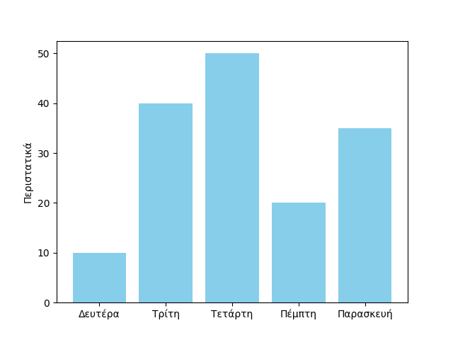

# Εργαστηριακό τμήμα μαθήματος

Στο εργαστήριο του μαθήματος οι γλώσσες προγραμματισμού που εξετάζονται είναι η Python, η Haskell και η Prolog, ως εκπρόσωποι του προστακτικού, του συναρτησιακού και του λογικού προγραμματισμού αντίστοιχα.

## Python

* [Εργαστήριο 1](./lab1_python.md)
* [Εργαστήριο 2](./lab2_python.md)
* [Εργαστήριο 3](./lab3_python.md)
* [Εργαστήριο 4](./lab4_python.md)
* [Εργαστήριο 5](./lab5_python.md)

## Haskell

* [Εργαστήριο 1](./lab1_haskell.md)
* [Εργαστήριο 2](./lab2_haskell.md)

<!-- ## Prolog -->


## Εργαστηριακές ασκήσεις 2023-2024

* [1η εργαστηριακή άσκηση (pdf)](./projects/2024_agp_assignment1.pdf)
    * [Ενδεικτική λύση](./assignment2024_1_sol.md)
* [2η εργαστηριακή άσκηση (pdf)](./projects/2024_agp_assignment2.pdf)
    * [Ενδεικτική λύση](./assignment2024_2_sol.md)

??? note "template για το my_re_functions.py"
    ```{.py title="my_re_functions_template.py" linenums="1"}
    --8<-- "projects/my_re_functions_template.py"
    ```
    Θα πρέπει να εμφανίζει:
    ```
    ΔΙΑΦΟΡΑ ΔΥΝΑΜΙΚΟΤΗΤΑΣ: 7
    ΝΙΚΗΤΗΣ: ΙΣΟΠΑΛΙΑ
    ΗΜΕΡΟΜΗΝΙΑ ΑΓΩΝΑ: 09-04-2023
    ΠΛΗΘΟΣ ΚΙΝΗΣΕΩΝ: 49
    ```

??? note "ανάγνωση και εκτύπωση ημερομηνιών"
    ```{.py title="datetime_example.py" linenums="1"}
    --8<-- "projects/datetime_example.py"
    ```
    Ένα παράδειγμα εκτέλεσης
    ```
    $ python datetime_example.py
    10/04/2024
    10|4|24
    10-April-24
    Wed 10 Apr 2024
    ```


??? note "ορίσματα γραμμής εντολών με το sys.argv"
    ```{.py title="command_line_arg_example1.py" linenums="1"}
    --8<-- "projects/command_line_arg_example1.py"
    ```
    Ένα παράδειγμα εκτέλεσης
    ```
    $ python command_line_arg_example1.py 1 a bcde
    ΠΛΗΘΟΣ ΟΡΙΣΜΑΤΩΝ: 4
    όρισμα 0 με τιμή /Users/.../command_line_arg_example1.py
    όρισμα 1 με τιμή 1
    όρισμα 2 με τιμή a
    όρισμα 3 με τιμή bcde
    ```

??? note "ορίσματα γραμμής εντολών με το argparse"
    ```{.py title="argparse_example.py" linenums="1"}
    --8<-- "projects/argparse_example.py"
    ```
    Ένα παράδειγμα εκτέλεσης
    ```
    $ python argparse_example.py -i a.txt -o b.txt
    Αρχείο εισόδου: a.txt
    Αρχείο εξόδου: b.txt
    ```

??? note "απλό γράφημα με το matplotlib"
    ```{.py title="matplotlib_example1.py" linenums="1"}
    --8<-- "projects/matplotlib_example1.py"
    ```
    Ένα παράδειγμα εκτέλεσης (θα πρέπει να έχει προηγηθεί η εγκατάσταση με το pip της βιβλιοθήκης matplotlib)
    ```
    $ python matplotlib_example1.py
    ```
    

* [3η εργαστηριακή άσκηση (pdf)](./projects/2024_agp_assignment3.pdf)