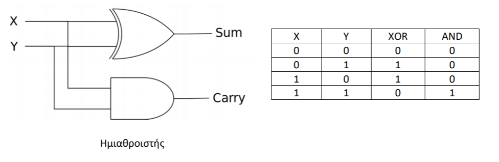

# Εργαστήριο 1 στην Prolog 

Θέματα που εξετάζονται στο εργαστήριο: γεγονότα[^1], κανόνες[^1], ερωτήματα[^1], ενοποίηση[^2], αναζήτηση απόδειξης[^2], αναδρομή[^3], αριθμητική με την Prolog[^4] 

## Εξάσκηση (εκφωνήσεις και λύσεις ασκήσεων)

**Άσκηση PRO1E1**
Δημιουργήστε βάση γνώσης με τα παρακάτω γεγονότα (facts):

1. Ο Σωκράτης είναι φιλόσοφος.
2. Ο Πλάτωνας είναι φιλόσοφος.
2. Ο Περικλής είναι πολιτικός.

Προσθέστε τους εξής κανόνες (rules):

1. Οι φιλόσοφοι είναι άνθρωποι.
2. Οι πολιτικοί είναι άνθρωποι.
3. Οι άνθρωποι είναι θηλαστικά.
4. Τα θηλαστικά είναι θνητά.

Κάντε τις εξής ερωτήσεις (queries):

1. Είναι ο Σωκράτης φιλόσοφος;
2. Είναι ο Περικλής φιλόσοφος;
3. Είναι ο Σωκράτης θηλαστικό;
4. Είναι ο Περικλής θνητός;
5. Ποιοι οντότητες είναι θνητές στη βάση γνώσης;

??? note "Λύση άσκησης PRO1E1"
    ```{.prolog title=pro1e1.pl linenums="1"}
    --8<-- "src/prolog/lab1/pro1e1.pl"
    ```

    Βάση γνώσης:

    * 7 clauses (προτάσεις)
    * 3 facts (γεγονότα)
    * 4 rules (κανόνες)
    * 5 predicates (κατηγορήματα) : philosopher\1, politician\1, human\1, mammal\1, mortal\1 
    * 3 atomic terms (ατομικοί όροι) : socrates, plato, pericles
    * 1 variable (μεταβλητή): X


    Φόρτωση του αρχείου `pro1e1.pl` στην Prolog:
    ```
    $ swipl -l pro1e1.pl
    ```

    Εναλλακτικός τρόπος φόρτωσης του αρχείου `pro1e1.pl` στην Prolog:
    ```
    $ swipl
    ?- consult('pro1e1.pl').
    ```
    
    Ένας ακόμα εναλλακτικός τρόπος φόρτωσης του αρχείου `pro1e1.pl` στην Prolog:
    ```
    $ swipl
    ?- ['pro1e1.pl'].
    ```

    Ερώτημα 1: Είναι ο Σωκράτης φιλόσοφος;
    ```
    ?- philosopher(socrates).
    true.
    ```

    Ερώτημα 2: Είναι ο Περικλής φιλόσοφος;
    ```
    ?- philosopher(pericles).
    false.
    ```

    Ερώτημα 3: Είναι ο Σωκράτης θηλαστικό;
    ```
    ?- mammal(socrates).      
    true.
    ```

    Ερώτημα 4: Είναι ο Περικλής θνητός;
    ```
    ?- mortal(pericles). 
    true.
    ```

    Ερώτημα 5: Ποιοι οντότητες είναι θνητές στη βάση γνώσης;
    ```
    ?- mortal(X).             
    X = socrates ;
    X = plato ;
    X = pericles.
    ```

**Άσκηση PRO1E2** Δημιουργήστε το κατηγόρημα `half_adder/4` που να υλοποιεί ένα κύκλωμα ημιαθροιστή. Δώστε 2 εναλλακτικές υλοποιήσεις με βάση τις ακόλουθες πληροφορίες.



Δίνεται ο πίνακας αληθείας του ημιαθροιστή:

| X   | Y   | C   | S   |
| --- | --- | --- | --- |
| 0   | 0   | 0   | 0   |
| 0   | 1   | 0   | 1   |
| 1   | 0   | 0   | 1   |
| 1   | 1   | 1   | 0   |

Τα `X`, `Y` είναι τα bits εισόδου, `C` είναι το bit κρατουμένου και `S` είναι το bit αθροίσματος.

Υποβάλετε τα ακόλουθα ερωτήματα:

1. Ποιες είναι οι είσοδοι που δίνουν στο bit αθροίσματος την τιμή 1;
2. Τι τιμή λαμβάνει το bit αθροίσματος αν το bit κρατουμένου είναι 1;


??? note "Λύση άσκησης PRO1E2 - α' υλοποίηση"
    ```{.prolog title=pro1e2.pl linenums="1"}
    --8<-- "src/prolog/lab1/pro1e2.pl"
    ```

    Φόρτωση του αρχείου `pro1e2.pl` στην Prolog:
    ```
    $ swipl -l pro1e2.pl
    ```
    
    Ερώτηση 1: Ποιες είναι οι είσοδοι που δίνουν στο bit αθροίσματος την τιμή 1;
    ```
    ?- half_adder(Χ,Υ,_,1).
    Χ = 0,
    Υ = 1 ;
    Χ = 1,
    Υ = 0 ;
    false.
    ```

    Ερώτηση 2: Τι τιμή λαμβάνει το bit αθροίσματος αν το bit κρατουμένου είναι 1;
    ```
    ?- half_adder(_,_,1,S). 
    S = 0.
    ```

??? note "Λύση άσκησης PRO1E2 - β' υλοποίηση"
    ```{.prolog title=pro1e2_alt.pl linenums="1"}
    --8<-- "src/prolog/lab1/pro1e2_alt.pl"
    ```

    Φόρτωση του αρχείου `pro1e2_alt.pl` στην Prolog:
    ```
    $ swipl -l pro1e2_alt.pl
    ```

    Ερώτηση 1: Ποιες είναι οι είσοδοι που δίνουν στο bit αθροίσματος την τιμή 1;
    ```
    ?- half_adder(Χ,Υ,_,1).
    Χ = 0,
    Υ = 1 ;
    Χ = 1,
    Υ = 0 ;
    false.
    ```

    Ερώτηση 2: Τι τιμή λαμβάνει το bit αθροίσματος αν το bit κρατουμένου είναι 1;
    ```
    ?- half_adder(_,_,1,S). 
    S = 0.
    ```

**Άσκηση PRO1E3** Έστω το ακόλουθο γενεαλογικό δένδρο:

        a 

       / \ 

      b   c 

     / \  | 

    d   e f 

που περιγράφεται με τις προτάσεις:
```pl
parent(a,b).
parent(a,c).
parent(b,d).
parent(b,e). 
parent(c,f). 
```
Το κατηγόρημα `parent(X,Y)` ερμηνεύεται ως ότι ο `X` είναι γονέας του `Υ`. 

Ορίστε τα κατηγορήματα:

* `sibling(X,Y)` Ισχύει όταν ο `Χ` και ο `Υ` είναι αδέρφια.
* `cousin(X,Y)` Ισχύει όταν ο `Χ` και ο `Υ` είναι ξαδέρφια.
* `grandchild(X,Y)` Ισχύει όταν ο `Χ` είναι εγγονός του `Υ`.
* `descendent(X,Y)` Ισχύει όταν ο `Χ` είναι απόγονος του `Υ`.

Υποβάλετε ερωτήματα που θα εμφανίζουν: 

1. Τα ζεύγη των αδερφών
2. Τα ζεύγη των ξαδερφιών
3. Τα εγγόνια του `a`  
4. Τους απογόνους του `a`

??? note "Λύση άσκησης PRO1E3"
    ```{.prolog title=pro1e3.pl linenums="1"}
    --8<-- "src/prolog/lab1/pro1e3.pl"
    ```

    Φόρτωση του αρχείου `pro1e3.pl` στην Prolog:
    ```
    $ swipl -l pro1e3.pl
    ```

    Ερώτηση 1: Εμφανίστε τα ζεύγη των αδερφιών.
    ```
    ?- sibling(X,Y).
    X = b,
    Y = c ;
    X = c,
    Y = b ;
    X = d,
    Y = e ;
    X = e,
    Y = d ;
    false.
    ```
    ή 
    ```
    ?- sibling(X,Y), format('~s ~s\n', [X,Y]), fail. 
    b c
    c b
    d e
    e d
    ```

    Ερώτηση 2: Εμφανίστε τα ζεύγη των ξαδερφιών.
    ```
    ?- cousin(X,Y).
    X = d,
    Y = f ;
    X = e,
    Y = f ;
    X = f,
    Y = d ;
    X = f,
    Y = e ;
    false.
    ```

    Ερώτηση 3: Εμφανίστε τα εγγόνια του a.
    ```
    ?- grandchild(X,a). 
    X = d ;
    X = e ;
    X = f.
    ```

    Ερώτηση 4: Εμφανίστε τους απογόνους του a.
    ```
    ?- descendent(X,a).
    X = b ;
    X = c ;
    X = d ;
    X = e ;
    X = f ;
    false.
    ```

**Άσκηση PRO1E4** Δίνεται ο ορισμός του κατηγορήματος `factorial/2` που υπολογίζει το παραγοντικό ενός ακεραίου αριθμού. 

```{.prolog title=factorial.pl linenums="1"}
--8<-- "src/prolog/lab1/factorial.pl"
```

Ορίστε το κατηγόρημα `doublefactorial/2` που να υπολογίζει το διπλό παραγοντικό ενός αριθμού `n`. Το διπλό παραγοντικό ορίζεται ως το γινόμενο όλων των ακεραίων από το 1 μέχρι και τον αριθμό `n` που είναι είτε άρτιοι είτε περιττοί, ανάλογα με το εάν το `n` είναι άρτιο ή περιττό αντίστοιχα (π.χ. το διπλό παραγοντικό του 7 είναι 1 * 3 * 5 * 7 = 105).

??? note "Λύση άσκησης PRO1E4"
    ```{.prolog title=pro1e4.pl linenums="1"}
    --8<-- "src/prolog/lab1/pro1e4.pl"
    ```

    Φόρτωση του αρχείου `pro1e4.pl` στην Prolog:
    ```
    $ swipl -l pro1e4.pl
    ```

    Ερώτημα με το κατηγόρημα `doublefactorial/2`:    
    ```
    ?- doublefactorial(7,F).
    F = 105.
    ```


[^1]: [Learn Prolog Now Ch.1](https://lpn.swi-prolog.org/lpnpage.php?pagetype=html&pageid=lpn-htmlch1)
[^2]: [Learn Prolog Now Ch.2](https://lpn.swi-prolog.org/lpnpage.php?pagetype=html&pageid=lpn-htmlch2)
[^3]: [Learn Prolog Now Ch.3](https://lpn.swi-prolog.org/lpnpage.php?pagetype=html&pageid=lpn-htmlch3)
[^4]: [Learn Prolog Now Ch.5](https://lpn.swi-prolog.org/lpnpage.php?pagetype=html&pageid=lpn-htmlch5)
