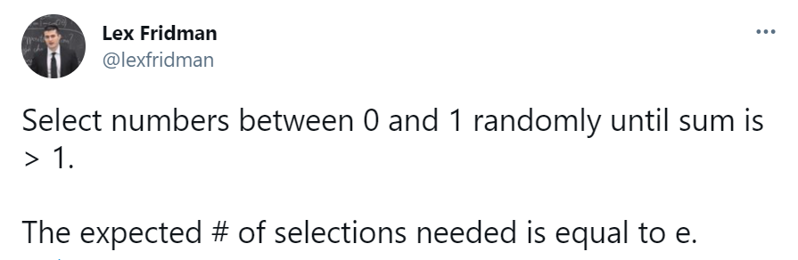

# Εργαστήριο 3 στην Python

## Εξάσκηση (εκφωνήσεις και λύσεις ασκήσεων)

**Άσκηση E3A1** - Στο ακόλουθο tweet ο [Lex Fridman](https://twitter.com/lexfridman) αναφέρει ότι η αναμενόμενη τιμή του πλήθους τυχαίων επιλογών αριθμών στο διάστημα 0 έως 1 που απαιτούνται έτσι ώστε το άθροισμά τους να ξεπεράσει το 1 είναι ίση με e=2.7182…



<!-- ```
  Select numbers between 0 and 1 randomly until sum is > 1.
  The expected # of selections needed is equal to e.
  — Lex Fridman (@lexfridman) March 8, 2021
``` -->

Τροποποιήστε το ακόλουθο template κώδικα έτσι ώστε η λύση σας να επιτυγχάνει στο unit test:

```{.py title="template3_1.py" linenums="1"}
--8<-- "src/python/lab3/template3_1.py"
```


**Άσκηση E3A2** - Κατεβάστε σε txt μορφή το βιβλίο “Μεταμόρφωση” του Φράνσις Κάφκα από το <https://www.gutenberg.org/ebooks/5200>. Γράψτε πρόγραμμα που να διαβάζει το κείμενο. Στη συνέχεια, απομονώστε το κείμενο της πρώτης παραγράφου (One morning...looked), μετατρέψτε το κείμενο σε πεζά γράμματα, και συμπληρώστε τις συναρτήσεις που απαντούν στα ακόλουθα ερωτήματα:

1. Ποιο είναι το πλήθος των λέξεων του κειμένου; Για το ερώτημα αυτό όπως και για τα επόμενα θεωρήστε ως λέξεις τις συμβολοσειρές που περιέχουν μόνο χαρακτήρες του αγγλικού αλφαβήτου. Επίσης, μας ενδιαφέρουν μόνο οι διαφορετικές μεταξύ τους λέξεις.
2. Ποιο είναι το πλήθος των λέξεων του κειμένου που ξεκινούν με τον χαρακτήρα 'h' και τελειώνουν με τον χαρακτήρα 'e';
3. Ποιο είναι το πλήθος των λέξεων του κειμένου με 5 χαρακτήρες;
4. Ποιο είναι το πλήθος λέξεων του κειμένου που περιέχουν συνεχόμενους τους χαρακτήρες 'a', 's';
5. Ποιο είναι το πλήθος λέξεων του κειμένου που περιέχουν συνεχόμενους τους χαρακτήρες 'a', 's' σε οποιαδήποτε σειρά;
6. Ποιο είναι το πλήθος λέξεων του κειμένου που ξεκινούν και τελειώνουν με τον ίδιο χαρακτήρα;
7. Ποιο είναι το πλήθος λέξεων του κειμένου που ξεκινούν και τελειώνουν με τους δύο ίδιους χαρακτήρες;


Τροποποιήστε το ακόλουθο template έτσι ώστε η λύση σας να επιτυγχάνει σε όλα τα unit tests:

```{.py title="template3_2.py" linenums="1"}
--8<-- "src/python/lab3/template3_2.py"
```

**Άσκηση E3A3** - Κατεβάστε το MovieLens [100K Dataset ml-100k.zip](https://grouplens.org/datasets/movielens/100k/). Εντοπίστε το αρχείο u.data που περιέχει 100.000 αξιολογήσεις από 943 χρήστες για 1.682 ταινίες και το αρχείο u.item που περιέχει τα στοιχεία των ταινιών. Εντοπίστε τις 10 ταινίες με τις καλύτερες αξιολογήσεις κατά μέσο όρο λαμβάνοντας υπόψη μόνο ταινίες που έχουν λάβει τουλάχιστον 50 αξιολογήσεις η κάθε μια. Εμφανίστε τους τίτλους αυτών των ταινιών. Παρατήρηση: Δείτε το αρχείο README στο ml-100k.zip για περιγραφή των περιεχομένων των αρχείων.

**Άσκηση E3A4** - Κατεβάστε το ακόλουθο XML αρχείο που περιέχει το πρόγραμμα αγώνων ενός πρωταθλήματος.

[ITC2021_Test8_SolGenMethodA.xml](datasets/itc2021/ITC2021_Test8_SolGenMethodA.xml)

Για κάθε αγώνα εμφανίστε την απόσταση περιόδων ανάμεσα στον αγώνα και στον επαναληπτικό του. Για παράδειγμα, για τις ομάδες 0 και 1 ο αγώνας 0-1 γίνεται στην περίοδο 33 και ο επαναληπτικός αγώνας 1-0 γίνεται στην περίοδο 14, άρα η απόσταση των δύο αγώνων είναι 33-14=19 αγωνιστικές.