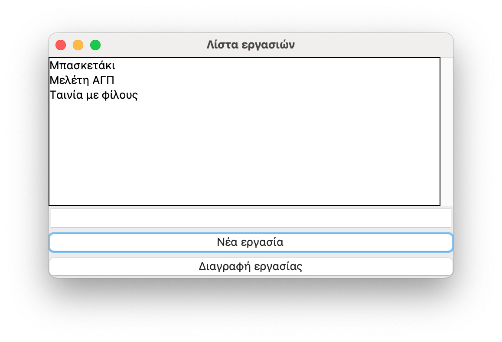

# Εργαστήριο 5 στην Python

Θέματα που εξετάζονται στο εργαστήριο: Γραφικά περιβάλλοντα διεπαφής με το tkinter[^1], APIs, matplotlib, MVC (Model View Controller)

## Εξάσκηση (εκφωνήσεις και λύσεις ασκήσεων)

**Άσκηση E5A1** - Δημιουργήστε ένα πρόγραμμα το οποίο να υλοποιεί μια λίστα εργασιών (todo list) μέσω ενός γραφικού περιβάλλοντος διεπαφής. Ο χρήστης να μπορεί να εισάγει εργασίες στη λίστα και να διαγράφει εργασίες από τη λίστα. Να μην επιτρέπεται η εισαγωγή της ίδιας εργασίας πάνω από μια φορά στη λίστα εργασιών.

??? note "Λύση άσκησης E5A1"
    ```{.py title="5_1_sol.py" linenums="1"}
    --8<-- "src/python/lab5/5_1_sol.py"
    ```
    Παράδειγμα εκτέλεσης:
    ```
    $ python 5_1_sol.py
    ```
    

??? note "Λύση άσκησης E5A1 με OOP"
    ```{.py title="5_1_sol_oop.py" linenums="1"}
    --8<-- "src/python/lab5/5_1_sol_oop.py"
    ```
    Παράδειγμα εκτέλεσης:
    ```
    $ python 5_1_sol_oop.py
    ```
    


**Άσκηση E5A2** - Δημιουργήστε ένα πρόγραμμα που να διαχειρίζεται επαφές (contacts). Για κάθε επαφή να διατηρούνται οι πληροφορίες, επώνυμο, όνομα, τηλέφωνο. Να παρέχεται λειτουργικότητα CRUD (Create, Retrieve, Update, Delete). Τα δεδομένα να αποθηκεύονται σε αρχείο contacts.csv και να ανακαλούνται από αυτό κατά την εκκίνηση του προγράμματος.

<!-- ??? note "Λύση άσκησης E5A2"
    ```{.py title="5_2_sol.py" linenums="1"}
    --8<-- "src/python/lab5/5_2_sol.py"
    ```
    Παράδειγμα εκτέλεσης:
    ```
    $ python 5_1_sol.py
    ``` -->

**Άσκηση E5A3** - Δημιουργήστε ένα πρόγραμμα που να απεικονίζει σε ένα γράφημα τις θερμοκρασίες για τις 5 τελευταίες ημέρες στην Άρτα [39.1606, 20.9853]. Χρησιμοποιήστε το module matplotlib για τη σχεδίαση του γραφήματος και για τη λήψη των θερμοκρασιών το [OpenWeathermap API](https://openweathermap.org/api).


**Άσκηση E5A4** - Χρησιμοποιήστε το pattern MVC έτσι ώστε να αναπτύξετε μια εφαρμογή που να πραγματοποιεί πράξεις πρόσθεσης, αφαίρεσης, πολλαπλασιασμού και διαίρεσης με μιγαδικούς αριθμούς. Στο ρόλο του view να μπορεί να εναλλάσσεται γραφικό περιβάλλον (GUI=Graphical User Interface) και περιβάλλον κειμένου (TUI=Text User Interface).

## Επιπλέον εξάσκηση

**Άσκηση E5A5** - Υλοποιήστε με το tkinter την 1η εργασία (Counter) από την ιστοσελίδα [7GUIs](https://eugenkiss.github.io/7guis/tasks). Δηλαδή, δημιουργήστε ένα παράθυρο όπως το ακόλουθο και κάθε φορά που ο χρήστης πατά το πλήκτρο Count η τιμή στο πεδίο κειμένου που κατά την εκκίνηση έχει τιμή 0 να αυξάνεται κατά 1.


<!-- 
??? note "Λύση άσκησης E5A5"
    ```{.py title="e5a5.py" linenums="1"}
    --8<-- "src/python/lab5/e5a5.py"
    ```
    Παράδειγμα εκτέλεσης:
    ```
    $ python e5a5.py
    ``` -->


[^1]: [Tkinter Tutorial](https://www.pythontutorial.net/tkinter/)
[^2]: [Tkinter Matplotlib](https://www.pythontutorial.net/tkinter/tkinter-matplotlib/)
[^3]: [Tkinter MVC](https://www.pythontutorial.net/tkinter/tkinter-mvc/)