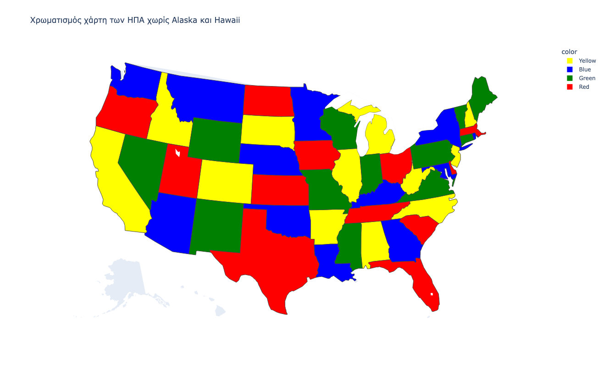

# Εργαστήριο 7 στην Python

Θέματα που εξετάζονται στο εργαστήριο: H βιβλιοθήκη OR-Tools της Google[^1], Constraint Programming[^2], CP-SAT[^3].

!!! note annotate "Εγκατάσταση εξωτερικών βιβλιοθηκών" 
    Για τις ακόλουθες ασκήσεις θα χρειαστεί να εγκαταστήσετε τις βιβλιοθήκες ortools, pandas, plotly.

**Άσκηση Ε7Α1** - Να λυθεί το κλασικό πρόβλημα κρυπταριθμητικής `SEND + MORE = MONEY` όπου κάθε γράμμα αντιστοιχεί σε ένα διαφορετικό ψηφίο από το 0 έως το 9. Τα πρώτα γράμματα των αριθμών δεν επιτρέπεται να είναι 0.

??? note "Λύση άσκησης E7A1"
    ```{.py title="e7a1.py" linenums="1"}
    --8<-- "src/python/lab7/e7a1.py"
    ```

??? note "Αποτέλεσμα εκτέλεσης E7A1"
    ```txt
    S = 9
    E = 5
    N = 6
    D = 7
    M = 1
    O = 0
    R = 8
    Y = 2
    SEND  =  9567
    MORE  =  1085
    MONEY = 10652
    ```

**Άσκηση Ε7Α2** - Να χρωματιστούν οι πολιτείες των ΗΠΑ εκτός από Alaska και Hawaii (48 πολιτείες), έτσι ώστε δύο πολιτείες που συνορεύουν να μην έχουν το ίδιο χρώμα. Χρησιμοποιήστε τα ακόλουθα δεδομένα για τα ονόματα πολιτειών και τις πολιτείες που είναι γειτονικές μεταξύ τους:

```py
states = [
    "AL", "AZ", "AR", "CA", "CO", "CT", "DE", "FL",
    "GA", "ID", "IL", "IN", "IA", "KS", "KY", "LA",
    "ME", "MD", "MA", "MI", "MN", "MS", "MO", "MT",
    "NE", "NV", "NH", "NJ", "NM", "NY", "NC", "ND",
    "OH", "OK", "OR", "PA", "RI", "SC", "SD", "TN",
    "TX", "UT", "VT", "VA", "WA", "WV", "WI", "WY"
]

edges = [
    ("AL", "FL"), ("AL", "GA"), ("AL", "MS"), ("AL", "TN"),
    ("AZ", "CA"), ("AZ", "CO"), ("AZ", "NV"), ("AZ", "NM"), ("AZ", "UT"),
    ("AR", "LA"), ("AR", "MS"), ("AR", "MO"), ("AR", "OK"), ("AR", "TN"), ("AR", "TX"),
    ("CA", "NV"), ("CA", "OR"),
    ("CO", "KS"), ("CO", "NE"), ("CO", "NM"), ("CO", "OK"), ("CO", "UT"), ("CO", "WY"),
    ("CT", "MA"), ("CT", "NY"), ("CT", "RI"),
    ("DE", "MD"), ("DE", "NJ"), ("DE", "PA"),
    ("FL", "GA"),
    ("GA", "NC"), ("GA", "SC"), ("GA", "TN"),
    ("ID", "MT"), ("ID", "NV"), ("ID", "OR"), ("ID", "UT"), ("ID", "WA"), ("ID", "WY"),
    ("IL", "IN"), ("IL", "IA"), ("IL", "KY"), ("IL", "MO"), ("IL", "WI"),
    ("IN", "KY"), ("IN", "MI"), ("IN", "OH"),
    ("IA", "MN"), ("IA", "MO"), ("IA", "NE"), ("IA", "SD"), ("IA", "WI"),
    ("KS", "MO"), ("KS", "NE"), ("KS", "OK"),
    ("KY", "MO"), ("KY", "OH"), ("KY", "TN"), ("KY", "VA"), ("KY", "WV"),
    ("LA", "MS"), ("LA", "TX"),
    ("ME", "NH"),
    ("MD", "PA"), ("MD", "VA"), ("MD", "WV"),
    ("MA", "NH"), ("MA", "NY"), ("MA", "RI"), ("MA", "VT"),
    ("MI", "OH"), ("MI", "WI"),
    ("MN", "ND"), ("MN", "SD"), ("MN", "WI"),
    ("MS", "TN"),
    ("MO", "NE"), ("MO", "OK"), ("MO", "TN"),
    ("MT", "ND"), ("MT", "SD"), ("MT", "WY"),
    ("NE", "SD"), ("NE", "WY"),
    ("NV", "OR"), ("NV", "UT"),
    ("NH", "VT"),
    ("NJ", "NY"), ("NJ", "PA"),
    ("NM", "OK"), ("NM", "TX"), ("NM", "UT"),
    ("NY", "PA"), ("NY", "VT"),
    ("NC", "SC"), ("NC", "TN"), ("NC", "VA"),
    ("ND", "SD"),
    ("OH", "PA"), ("OH", "WV"),
    ("OK", "TX"),
    ("OR", "WA"),
    ("PA", "WV"),
    ("SD", "WY"),
    ("TN", "VA"),
    ("TX", "NM"),
    ("UT", "WY"),
    ("VA", "WV")
]
```

??? note "Λύση άσκησης E7A2"
    ```{.py title="e7a2.py" linenums="1"}
    --8<-- "src/python/lab7/e7a2.py"
    ```

??? note "Αποτέλεσμα εκτέλεσης E7A2"
    ```txt
    Βρέθηκε χρωματισμός:
    AL -> Κίτρινο
    AZ -> Μπλε
    AR -> Κίτρινο
    CA -> Κίτρινο
    CO -> Κίτρινο
    CT -> Πράσινο
    DE -> Κόκκινο
    FL -> Κόκκινο
    GA -> Μπλε
    ID -> Κίτρινο
    IL -> Κίτρινο
    IN -> Πράσινο
    IA -> Κόκκινο
    KS -> Κόκκινο
    KY -> Μπλε
    LA -> Μπλε
    ME -> Πράσινο
    MD -> Μπλε
    MA -> Κόκκινο
    MI -> Κίτρινο
    MN -> Μπλε
    MS -> Πράσινο
    MO -> Πράσινο
    MT -> Μπλε
    NE -> Μπλε
    NV -> Πράσινο
    NH -> Κίτρινο
    NJ -> Κίτρινο
    NM -> Πράσινο
    NY -> Μπλε
    NC -> Κίτρινο
    ND -> Κόκκινο
    OH -> Κόκκινο
    OK -> Μπλε
    OR -> Κόκκινο
    PA -> Πράσινο
    RI -> Μπλε
    SC -> Κόκκινο
    SD -> Κίτρινο
    TN -> Κόκκινο
    TX -> Κόκκινο
    UT -> Κόκκινο
    VT -> Πράσινο
    VA -> Πράσινο
    WA -> Μπλε
    WV -> Κίτρινο
    WI -> Πράσινο
    WY -> Πράσινο
    ```
    


**Άσκηση Ε7Α3** - Να γραφεί πρόγραμμα σε Python με χρήση του OR-Tools CP-SAT solver για την επίλυση του προβλήματος των `Ν` βασιλισσών. Το πρόγραμμα πρέπει να τοποθετεί `N` βασίλισσες σε μια σκακιέρα διαστάσεων `N x N`, έτσι ώστε καμία βασίλισσα να μην απειλεί κάποια άλλη, δηλαδή να μην υπάρχουν δύο βασίλισσες στην ίδια γραμμή, στην ίδια στήλη ή στην ίδια διαγώνιο. Θεωρήστε αρχικά `N = 8`, αλλά το πρόγραμμα θα πρέπει να μπορεί να εκτελεστεί και για διαφορετικές τιμές του `N`. Να μοντελοποιήσετε το πρόβλημα με μεταβλητές απόφασης και περιορισμούς, να καλέσετε τον solver και να εμφανίσετε μία εφικτή λύση σε μορφή σκακιέρας, χρησιμοποιώντας το σύμβολο `Q` για τις θέσεις των βασιλισσών και το σύμβολο `.` για τα κενά τετράγωνα.

??? note "Λύση άσκησης E7A3"
    ```{.py title="e7a3.py" linenums="1"}
    --8<-- "src/python/lab7/e7a3.py"
    ```

??? note "Αποτέλεσμα εκτέλεσης E7A3"
    ```txt
    Γραμμή 0: στήλη 2
    Γραμμή 1: στήλη 0
    Γραμμή 2: στήλη 6
    Γραμμή 3: στήλη 4
    Γραμμή 4: στήλη 7
    Γραμμή 5: στήλη 1
    Γραμμή 6: στήλη 3
    Γραμμή 7: στήλη 5

    Σκακιέρα:
    . . Q . . . . .
    Q . . . . . . .
    . . . . . . Q .
    . . . . Q . . .
    . . . . . . . Q
    . Q . . . . . .
    . . . Q . . . .
    . . . . . Q . .
    ```

**Άσκηση Ε7Α4** - Προγραμματισμός εργασιών σε μία μηχανή με ελαχιστοποίηση συνολικής καθυστέρησης

Να γραφεί πρόγραμμα σε Python με χρήση του OR-Tools CP-SAT solver για τον προγραμματισμό ενός συνόλου εργασιών σε μία μηχανή. Κάθε εργασία έχει γνωστό χρόνο επεξεργασίας, βάρος και προθεσμία ολοκλήρωσης, ενώ η μηχανή μπορεί να εκτελεί μόνο μία εργασία κάθε χρονική στιγμή. Το πρόγραμμα πρέπει να αποφασίζει τη σειρά εκτέλεσης των εργασιών, να υπολογίζει τον χρόνο έναρξης και ολοκλήρωσης κάθε εργασίας και να εξασφαλίζει ότι δεν υπάρχουν επικαλύψεις μεταξύ των εργασιών. Στόχος είναι η ελαχιστοποίηση της συνολικής σταθμισμένης καθυστέρησης: $\sum_j{w_jT_j}$, όπου η καθυστέρηση μιας εργασίας ορίζεται ως $T_j = \max(C_j - d_j, 0)$, με $C_j$ τον χρόνο ολοκλήρωσης και $d_j$ την προθεσμία της εργασίας.

A) Επιλύστε την άσκηση για τα ακόλουθα δεδομένα:

```py
# Εργασίες 0 έως 9
processing_times = [12, 8, 15, 6, 20, 7, 10, 14, 9, 11]
weights = [4, 2, 5, 3, 6, 1, 4, 7, 2, 5]
due_dates = [25, 20, 35, 18, 45, 30, 28, 40, 32, 38]
```

??? note "Λύση άσκησης E7A4Α"
    ```{.py title="e7a4.py" linenums="1"}
    --8<-- "src/python/lab7/e7a4.py"
    ```

??? note "Αποτέλεσμα εκτέλεσης E7A4A"
    ```txt
    Κατάσταση λύσης: OPTIMAL
    Τιμή αντικειμενικής συνάρτησης: 892

    Πρόγραμμα εκτέλεσης:
    Job | Start |   End |  p_j |  d_j |  w_j |  T_j | w_j*T_j
    ----------------------------------------------------------
    3 |     0 |     6 |    6 |   18 |    3 |    0 |       0
    0 |     6 |    18 |   12 |   25 |    4 |    0 |       0
    6 |    18 |    28 |   10 |   28 |    4 |    0 |       0
    7 |    28 |    42 |   14 |   40 |    7 |    2 |      14
    9 |    42 |    53 |   11 |   38 |    5 |   15 |      75
    2 |    53 |    68 |   15 |   35 |    5 |   33 |     165
    4 |    68 |    88 |   20 |   45 |    6 |   43 |     258
    1 |    88 |    96 |    8 |   20 |    2 |   76 |     152
    8 |    96 |   105 |    9 |   32 |    2 |   73 |     146
    5 |   105 |   112 |    7 |   30 |    1 |   82 |      82

    Σειρά εργασιών: [3, 0, 6, 7, 9, 2, 4, 1, 8, 5]
    ```

B) Επιλύστε το ίδιο πρόβλημα για τα αρχεία [wt40.txt](./src/python/lab7/wt40.txt), [wt50.txt](./src/python/lab7/wt50.txt) και [wt100.txt](./src/python/lab7/wt100.txt) που περιέχουν το καθένα 125 στιγμιότυπα προβλημάτων με 40, 50 και 100 εργασίες αντίστοιχα από το δημόσιο benchmark `single-machine total weighted tardiness` της [OR-Library](https://people.brunel.ac.uk/~mastjjb/jeb/orlib/wtinfo.html). Κάθε στιγμιότυπο περιέχει με τη σειρά, τους χρόνους επεξεργασίας, τα βάρη και τις προθεσμίες των εργασιών.

??? note "Λύση άσκησης E7A4Β"
    ```{.py title="e7a4.py" linenums="1"}
    --8<-- "src/python/lab7/e7a4.py"
    ```

??? note "Αποτέλεσμα εκτέλεσης E7A4A για το στιγμιότυπο 1 του wt40.txt"
    ```txt
    Κατάσταση: OPTIMAL
    Τιμή αντικειμενικής συνάρτησης: 913
    Καλύτερο κάτω φράγμα: 913
    Χρόνος επίλυσης: 18.173 sec

    Σειρά εργασιών:
    [18, 25, 37, 11, 6, 24, 19, 10, 16, 35, 38, 36, 29, 5, 9, 22, 34, 21, 33, 32, 15, 4, 14, 26, 3, 27, 13, 30, 1, 0, 2, 8, 23, 20, 28, 17, 31, 39, 7, 12]

    Job |  Start |    End |   p_j |   w_j |    d_j |    T_j |   w_j*T_j
    ------------------------------------------------------------------------
    18 |      0 |     90 |    90 |     4 |   1484 |      0 |         0
    25 |     90 |    185 |    95 |     5 |   1509 |      0 |         0
    37 |    185 |    194 |     9 |    10 |   1446 |      0 |         0
    11 |    194 |    240 |    46 |     3 |   1539 |      0 |         0
    6 |    240 |    313 |    73 |     3 |   1566 |      0 |         0
    24 |    313 |    398 |    85 |     9 |   1522 |      0 |         0
    19 |    398 |    453 |    55 |     7 |   1559 |      0 |         0
    10 |    453 |    539 |    86 |     7 |   1599 |      0 |         0
    16 |    539 |    603 |    64 |     7 |   1582 |      0 |         0
    35 |    603 |    671 |    68 |     7 |   1497 |      0 |         0
    38 |    671 |    720 |    49 |     1 |   1579 |      0 |         0
    36 |    720 |    790 |    70 |     5 |   1481 |      0 |         0
    29 |    790 |    876 |    86 |     4 |   1628 |      0 |         0
    5 |    876 |    911 |    35 |     4 |   1487 |      0 |         0
    9 |    911 |    978 |    67 |     3 |   1636 |      0 |         0
    22 |    978 |   1014 |    36 |     5 |   1512 |      0 |         0
    34 |   1014 |   1044 |    30 |     7 |   1541 |      0 |         0
    21 |   1044 |   1096 |    52 |     3 |   1510 |      0 |         0
    33 |   1096 |   1108 |    12 |     5 |   1528 |      0 |         0
    32 |   1108 |   1147 |    39 |     9 |   1627 |      0 |         0
    15 |   1147 |   1241 |    94 |     4 |   1660 |      0 |         0
    4 |   1241 |   1273 |    32 |    10 |   1694 |      0 |         0
    14 |   1273 |   1302 |    29 |    10 |   1709 |      0 |         0
    26 |   1302 |   1316 |    14 |     2 |   1598 |      0 |         0
    3 |   1316 |   1362 |    46 |    10 |   1773 |      0 |         0
    27 |   1362 |   1440 |    78 |     8 |   1658 |      0 |         0
    13 |   1440 |   1480 |    40 |     3 |   1645 |      0 |         0
    30 |   1480 |   1524 |    44 |     7 |   1650 |      0 |         0
    1 |   1524 |   1548 |    24 |    10 |   1620 |      0 |         0
    0 |   1548 |   1574 |    26 |     1 |   1588 |      0 |         0
    2 |   1574 |   1653 |    79 |     9 |   1731 |      0 |         0
    8 |   1653 |   1667 |    14 |    10 |   1727 |      0 |         0
    23 |   1667 |   1736 |    69 |     4 |   1795 |      0 |         0
    20 |   1736 |   1771 |    35 |     5 |   1772 |      0 |         0
    28 |   1771 |   1808 |    37 |    10 |   1826 |      0 |         0
    17 |   1808 |   1835 |    27 |     7 |   1836 |      0 |         0
    31 |   1835 |   1863 |    28 |     4 |   1833 |     30 |       120
    39 |   1863 |   1913 |    50 |     3 |   1814 |     99 |       297
    7 |   1913 |   1987 |    74 |     2 |   1844 |    143 |       286
    12 |   1987 |   2065 |    78 |     1 |   1855 |    210 |       210    
    ```

<!-- **Άσκηση Ε7Α5** - Να γραφεί πρόγραμμα σε Python με χρήση του OR-Tools CP-SAT solver για την επίλυση του κλασικού προβλήματος άνθρωπος, λύκος, κατσίκα και λάχανο. Ένας άνθρωπος πρέπει να μεταφέρει έναν λύκο, μία κατσίκα και ένα λάχανο από την αριστερή όχθη ενός ποταμού στη δεξιά όχθη, χρησιμοποιώντας μία βάρκα. Η βάρκα μπορεί να μεταφέρει σε κάθε διαδρομή μόνο τον άνθρωπο και το πολύ ένα ακόμη αντικείμενο ή ζώο. Ο άνθρωπος πρέπει να βρίσκεται πάντα στη βάρκα για να πραγματοποιηθεί μετακίνηση. Δεν επιτρέπεται να μείνουν ποτέ χωρίς τον άνθρωπο στην ίδια όχθη ο λύκος με την κατσίκα, γιατί ο λύκος θα φάει την κατσίκα, ούτε η κατσίκα με το λάχανο, γιατί η κατσίκα θα φάει το λάχανο. Να μοντελοποιήσετε το πρόβλημα ως πρόβλημα ικανοποίησης περιορισμών, θεωρώντας διακριτά χρονικά βήματα μετακινήσεων, και να βρείτε μία ακολουθία έγκυρων μετακινήσεων που μεταφέρει όλα τα στοιχεία στη δεξιά όχθη. 

Χρησιμοποιήστε τα ακόλουθα:

```py
items = ["man", "wolf", "goat", "cabbage"]

LEFT = 0
RIGHT = 1

max_steps = 7
```

Τα αποτελέσματα να εμφανίζονται με την ακόλουθη μορφή:

```txt
Βήμα 1: ο άνθρωπος μεταφέρει την κατσίκα προς τα δεξιά
Βήμα 2: ο άνθρωπος επιστρέφει μόνος προς τα αριστερά
...
```


??? note "Λύση άσκησης E7A5"
    ```{.py title="e7a4.py" linenums="1"}
    --8<-- "src/python/lab7/e7a4.py"
    ``` -->

[^1]: [Google OR-Tools](https://developers.google.com/optimization)
[^2]: [Google OR-Tools Constraint Optimization Guide](https://developers.google.com/optimization/cp)
[^3]: [CPSAT Primer](https://d-krupke.github.io/cpsat-primer/)